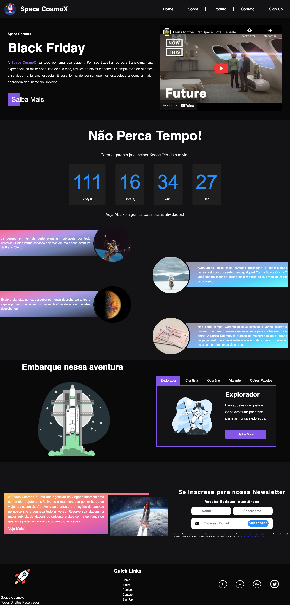

# Hiring Coders - Challenge - 01 (Landing Page)

  

## About:
This landing page was developed as part of the first challenge of Hiring Coders program of Gama Academy / VTEX.

## Preview:

  

## Credits:
* [Unplash](https://unsplash.com/s/photos/space-rocket)
* [Storyset](https://storyset.com/)
* [Colorspace](https://mycolor.space/)